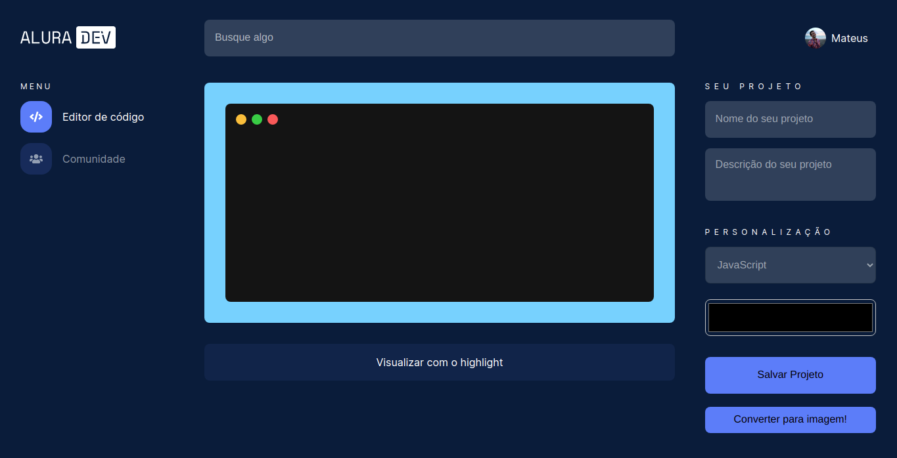

# Alura Dev - Editor de código

Alura Dev é um editor de código que te permite compartilhar códigos de forma mais atraente, possibilitando salvar o projeto tanto na aba comunidade como em um arquivo em png, jpeg ou svg.

## Como rodar o projeto

Primeiramente é necessário ter o node js instalado, com o node instalado, clone o projeto com `git clone https://github.com/mateushenrique-dev/alura-challenge-frontend`, após clonar o projeto, no console do seu editor de código digite o seguinte comando `npm install` para instalar todas as dependencias, e em seguida use `npm start` para iniciar o projeto :D

## Como utilizar

- Para utilizar o editor de código, basta clicar no bloco preto e começar a digitar, após ter digitado o seu código, clique em "Vidualisar com o highlight" 

 - Para que o highlight se ative. Para alterar a cor de fundo do editor, clique no color picked abaixo de personalização e escolha a cor desejada. 
 
 - Para salvar o projeto, é necessario preencher os campos de nome e descrição, após isso clicar em "Salvar projeto". 

 - Para visualizar o seu projeto, basta clicar na aba "Comunidade" no menu da esquerda que lá estará todos os seus projetos criados.

 - Para salvar o seu código em alguma extensão, clique em "Coverter para imagem!" e escolha a extensão desejada e em seguida clique em "ok".

## Conteúdos

- [Overview](#overview)
  - [O Challenge](#the-challenge)
  - [Screenshot](#screenshot)
  - [Links](#links)
- [Processo](#processo)
  - [Contruido com](#construido-com)
  - [O que eu aprendi](#oque-eu-aprendi)
  - [Continuação do desenvolvimento](#continuacao-do-desenvolvimento)
  - [Recursos úteis](#recursos-uteis)
- [Autor](#autor)

## Overview

### O Challenge

Os usuarios serão capazes de:

- Editar o código e setar o highlight
- Salvar o seu projeto na aba comunidades
- Salvar o seu projeto em extensões png, jpeg ou svg
- Verificar seu projeto na aba comunidades
- Projetos permanecerem na aba comunidades.

### Screenshot

### Links

- Site hospedado: [Alura Dev](https://alura-challenge-frontend.vercel.app/)

## Processo

### Construito com

- Tags HTMl semânticas
- Sass
- Flexbox
- Grid Layout
- [React](https://reactjs.org/) - JS library

### O que eu aprendi

- Utilizar bibliotecas como:
  - [Highlight JS](https://highlightjs.org/)
  - [File Saver](https://github.com/eligrey/FileSaver.js/)
  - [Dom to image](https://github.com/tsayen/dom-to-image)
- Desenvolvimento em grupo, ajudando e sendo ajudado no discord.
- Utilizar o trello para organizar minhas tarefas.

### Continuação do desenvolvimento

Pretendo adicionar algumas features como:

- Alterar nome e foto de perfil
- Dar like
- Ver perfil
- Adicionar github no perfil
- Barra de pesquisa funcional

## Autor

- Site - [Mateus Henrique](https://mateushenriquedev.ml/)
- Frontend Mentor - [mateushenrique-dev](https://www.frontendmentor.io/profile/mateushenrique-dev)
- GitHub - [mateushenrique-dev](https://github.com/mateushenrique-dev)